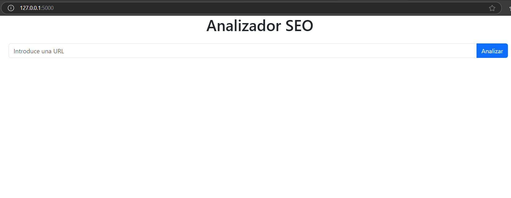
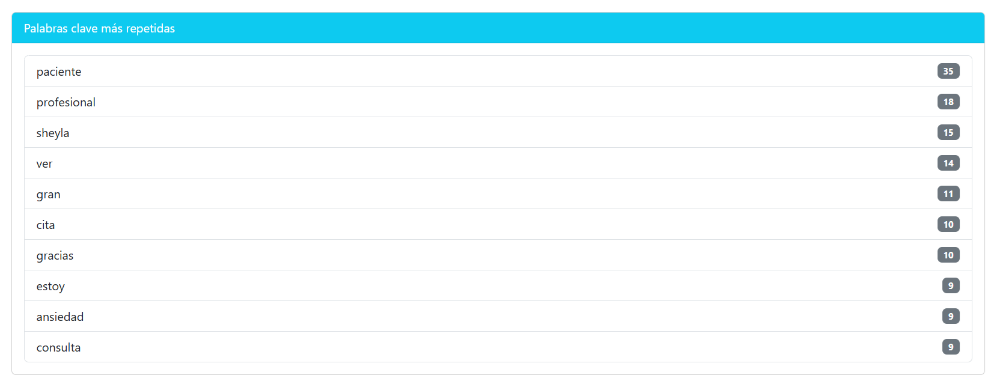
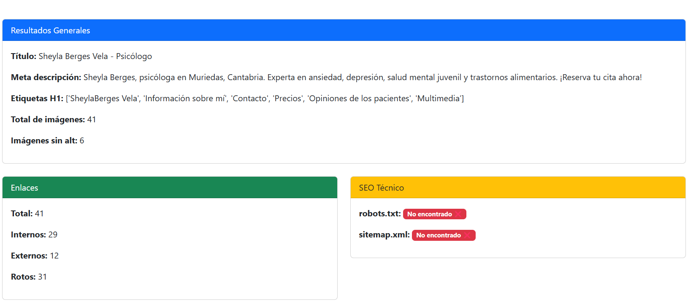

# 🔍 Analizador SEO - WebApp

Este es un proyecto personal desarrollado con **Python + Flask**, que permite analizar una página web desde el punto de vista SEO. Ofrece un informe visual completo sobre elementos clave como títulos, meta descripciones, encabezados, enlaces, imágenes y palabras clave.

---

## 🎯 Funcionalidades

✅ Análisis de:
- Título (`<title>`) y Meta descripción
- Encabezados `<h1>`
- Imágenes sin atributo `alt`
- Enlaces internos, externos y rotos
- Palabras clave más repetidas
- Presencia de `robots.txt` y `sitemap.xml`

🧠 Diseño moderno con Bootstrap  
💡 Interfaz sencilla, clara y totalmente responsiva  
🚀 Preparado para futuras integraciones (PDF, historial, etc.)

---

## 🛠 Tecnologías usadas

- **Python** (Flask)
- **HTML5 + CSS3**
- **Bootstrap 5**
- **BeautifulSoup4**
- **requests**
- Estructurado bajo buenas prácticas para ser mantenible y escalable.

---

## 🧪 Cómo usarlo en local

### 1. Clona el repositorio:

```bash
git clone https://github.com/tu-usuario/seo-analyzer.git
cd seo-analyzer


2. Crea y activa un entorno virtual (opcional pero recomendado):
python -m venv venv
venv\Scripts\activate   # En Windows
source venv/bin/activate  # En Linux/macOS

3. Instala las dependencias:
pip install -r requirements.txt

4. Ejecuta la app:
python main.py

5. Abre tu navegador:
http://127.0.0.1:5000

📂 Estructura del proyecto
seo-analyzer/
│
├── app/
│   ├── analyzer.py
│   ├── routes.py
│   ├── static/
│   │   └── styles.css
│   └── templates/
│       └── index.html
│
├── main.py
├── requirements.txt
└── README.md


👨‍💻 Autor
Javier Mosquera
Desarrollador de Aplicaciones Multiplataforma
📧 alejandrom8607@gmail.com
📍 Zaragoza, España

📃 Licencia
Este proyecto se distribuye bajo licencia MIT. ¡Úsalo, modifícalo y comparte! 🚀

## 📸 Capturas de pantalla

## 📸 Capturas de pantalla

### 🏁 Pantalla de inicio


### 🧾 Formulario con URL


### 📊 Resultados del informe

